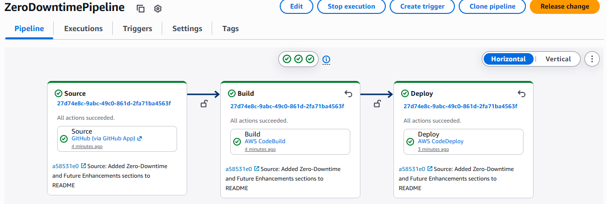
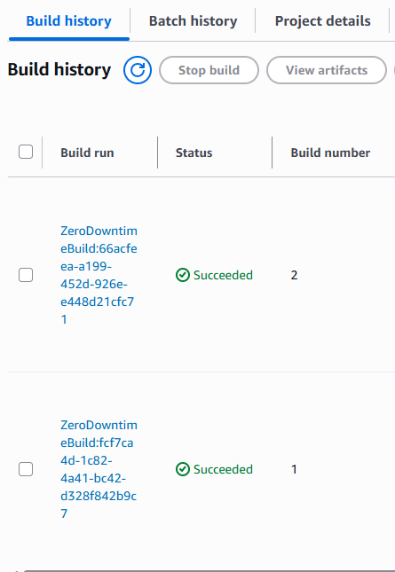
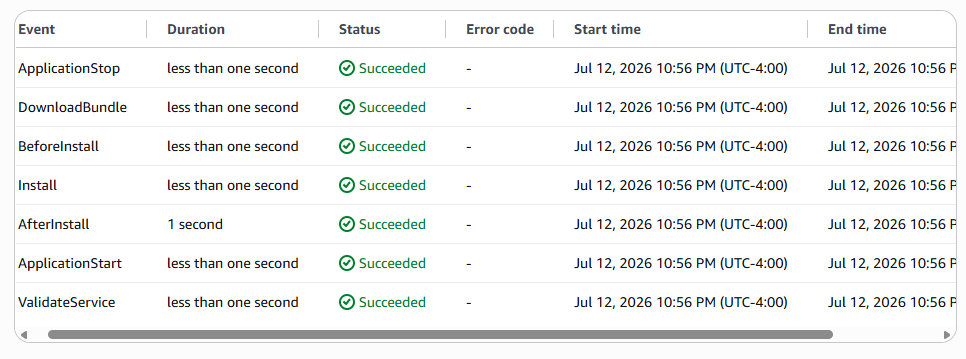

# Zero-Downtime-Deployment-Pipeline
Automated CI/CD pipeline using GitHub, AWS CodePipeline, CodeBuild, and CodeDeploy to deliver application updates with zero downtime, rollback protection, and consistent deployment workflows.

Designed for safe, repeatable, production-grade application releases.

---

## 📌 Overview
This project demonstrates how to build a real-world, production-grade CI/CD pipeline on AWS. It automates the entire software delivery lifecycle:

- Source control (GitHub)
- Build & test (CodeBuild)
- Artifact storage (S3)
- Deployment orchestration (CodeDeploy)
- Continuous delivery (CodePipeline)

The pipeline deploys a lightweight web application to an EC2 instance using a safe, controlled, zero-downtime deployment strategy — mirroring how CloudOps, DevOps, and Platform Engineering teams ship code in real companies.

---

## 🎯 Business Problem
Modern companies struggle with:

- slow, manual deployments  
- human error causing outages  
- inconsistent release processes  
- downtime during updates  
- lack of rollback mechanisms  
- long lead times between development and production  

These issues reduce reliability, increase operational risk, and slow down engineering teams.

This project solves those problems by implementing a fully automated CI/CD pipeline that ensures:

- consistent deployments  
- automated testing  
- safe rollouts  
- automatic rollback on failure  
- zero downtime  
- faster delivery cycles  
- improved reliability  

---

## 🏗️ Architecture Diagram (Conceptual)

GitHub (Source)
     │
     ▼
AWS CodePipeline
     │
     ├── Source Stage (GitHub Webhook)
     │
     ├── Build Stage (CodeBuild)
     │       └── buildspec.yml
     │
     └── Deploy Stage (CodeDeploy)
             ├── appspec.yml
             ├── install.sh
             └── start.sh
     
EC2 Instance (Deployment Target)
S3 Bucket (Pipeline Artifacts)
IAM Roles (Pipeline, Build, Deploy)

---

## 🖼️ Architecture Diagram (Visual)
(To be added once the pipeline is complete.)

---

## 🧩 Key Features

🔹 **Automated Build & Test**  
CodeBuild compiles and validates the application using a `buildspec.yml` file.

🔹 **Zero-Downtime Deployment**  
CodeDeploy uses lifecycle hooks to deploy updates safely without interrupting service.

🔹 **Automatic Rollback**  
If health checks fail, CodeDeploy automatically reverts to the previous version.

🔹 **GitHub Integration**  
Pipeline triggers automatically when new code is pushed.

🔹 **Artifact Management**  
Build artifacts are stored in an S3 bucket for traceability and auditing.

🔹 **Infrastructure Security**  
IAM roles follow least privilege, and EC2 uses an instance profile — no stored access keys.

🔹 **Professional Documentation**  
Each step is documented to mirror real CloudOps/DevOps workflows.

---

## 📦 Project Structure

Zero-Downtime-Deployment-Pipeline/
│
├── index.html
│
├── buildspec.yml
│
├── appspec.yml
│
├── scripts/
│   ├── install.sh
│   └── start.sh
│
└── README.md

---

## 🚀 Deployment Instructions

### 1. Clone the repo
git clone https://github.com/GarciaAlexander/Zero-Downtime-Deployment-Pipeline.git
cd Zero-Downtime-Deployment-Pipeline

### 2. Review the application
The `index.html` file is the application deployed through the pipeline.

### 3. Review the buildspec
Defines how CodeBuild prepares the deployment artifact.

### 4. Review the appspec
Defines how CodeDeploy installs and starts the application on EC2.

### 5. Create the S3 artifact bucket
Used by CodePipeline and CodeBuild.

### 6. Create IAM roles
- CodePipeline role  
- CodeBuild role  
- CodeDeploy role  
- EC2 instance profile  

### 7. Launch EC2 instance
Install CodeDeploy agent.

### 8. Create CodePipeline
Connect GitHub → S3 → CodeBuild → CodeDeploy.

### 9. Push a code change
Pipeline triggers automatically and deploys the update.

---

## 🛡️ Security Considerations
- IAM roles follow least privilege  
- EC2 uses an instance profile (no access keys)  
- S3 artifact bucket is private  
- Pipeline artifacts are versioned  
- Deployment scripts are controlled and auditable  
- GitHub webhook uses secure token authentication  

---

## 👤 Author
**Alexander Garcia**  
AWS CloudOps Engineer • CI/CD • DevOps • Infrastructure-as-Code

---

## ⚙️ How Zero‑Downtime Deployment Works

This pipeline uses AWS CodeDeploy’s lifecycle event hooks to deploy updates safely without interrupting service.

### 1. BeforeInstall
CodeDeploy prepares the instance for deployment. Typical tasks include:
- stopping existing processes
- cleaning old files
- preparing directories

### 2. AfterInstall
The new application files are copied to the instance. This ensures the latest version is staged and ready.

### 3. ApplicationStart
Your application is started or restarted using a script such as `start.sh`.

### 4. Health Checks
CodeDeploy verifies that the application is running correctly. If health checks fail:

### Automatic Rollback
CodeDeploy automatically restores the previous working version, ensuring zero downtime and protecting the user experience.

This approach mirrors real production deployment strategies used by CloudOps and DevOps teams.

---

## 🔮 Future Enhancements

This project can be extended with additional production‑grade features:

### Blue/Green Deployments
Deploy new versions to a separate environment and switch traffic using a load balancer.

### Load Balancer Integration
Add an Application Load Balancer (ALB) for improved availability and health‑based routing.

### Auto Scaling
Automatically scale EC2 instances based on CPU, memory, or request load.

### Multi‑Environment Pipeline
Add separate pipelines for dev, stage, and prod with approval gates.

### CloudWatch Alarms & Monitoring
Trigger rollbacks or notifications based on application health metrics.

### HTTPS + Domain Integration
Use Route 53 + ACM to serve the application over HTTPS with a custom domain.

### Infrastructure as Code
Rebuild the entire pipeline using CloudFormation, CDK, or Terraform.

These enhancements mirror how real enterprise CI/CD systems evolve over time.

---

## 📸 Screenshots (Pipeline Visuals)

Below are key screenshots demonstrating the successful CI/CD pipeline execution.

### Pipeline Execution

### CodeBuild History

### CodeDeploy Lifecycle Events

---

## 🏁 Final Notes
This project demonstrates real DevOps and CloudOps skills:

- automated deployments  
- zero-downtime release strategies  
- rollback protection  
- CI/CD best practices  
- secure IAM design  
- professional documentation  
- real-world pipeline architecture  
